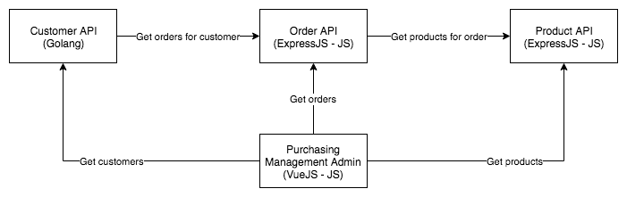

# Contract Test Workshop

This repository is the basis for a Fresh8 Contract Testing workshop using [Pact](https://docs.pact.io/).

## Overview

Some fool decided to create a single page web app admin interface to a very weird
purchasing system. It is roughly laid out as shown in the diagram below, however
who knows if it's up to date, or even right.

> 

Unfortunately, someone else threw this into production, so it's what we've got to
work with. Based on the mounting backlog, the overloaded kanban board, and the Jira
server fire that is imminent, it seems wise to sugar coat our current setup with
some contract testing to ensure all our new glorious features and bug fixes don't
set everything else ablaze.

More information will be provided by a lead engineer at the point everything kicks
off. Please do ask questions, raise issues with the core codebase on this project,
and generally have fun learning!

## Access

| Service  | URL                   | README                       |
| -------- | --------------------- | ---------------------------- |
| Customer | http://localhost:3003 | [README](customer/README.md) |
| Product  | http://localhost:3002 | [README](product/README.md)  |
| Order    | http://localhost:3001 | [README](order/README.md)    |
| Admin    | http://localhost:3000 | [README](admin/README.md)    |

## Setup

The project uses Docker for development, the following command should get you up and running relatively quickly:

```sh
docker-compose up
```

### Running Commands

To run commands on each machine, for installing packages or running tools, you can use the following:

```sh
docker-compose run customer dep ensure
```

In this example, `customer` is the container, and `dep ensure` is the command being run.
